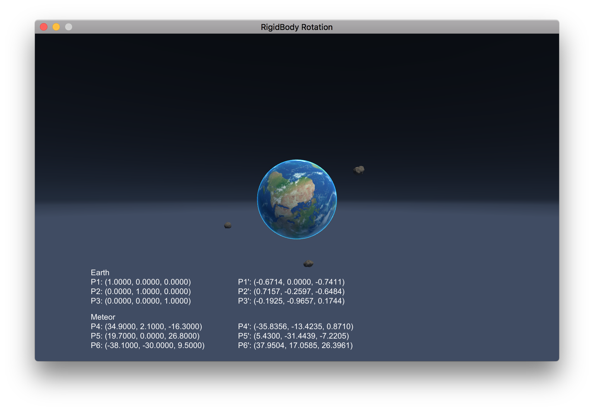

# MathVision

Mathematical Tools for Computer Vision

#### HW_5: RigidBody Rotation

Homework code is in RigidBody\ Rotation/Assets/Scripts/HW5_Code.cs. If you want to test this code, use the HW5_test scene RigidBody\ Rotation/Assets/Scenes/. 

In RigidBody\ Rotation/Assets/Scripts/compute_user_rotation.cs, you can find the modified version used for this demo.

You can try the demo by downloading the Matrix_rotation_demo file:
https://drive.google.com/open?id=1orIUXbI8_EX8XisUvR3CVVfVfoEyWU8M

The demo is very straightforward. Just drag the earth around with your mouse to change the position of p1, p2 and p3. The compute_user_rotation.cs will compute the difference and update the meteor's position accordingly.