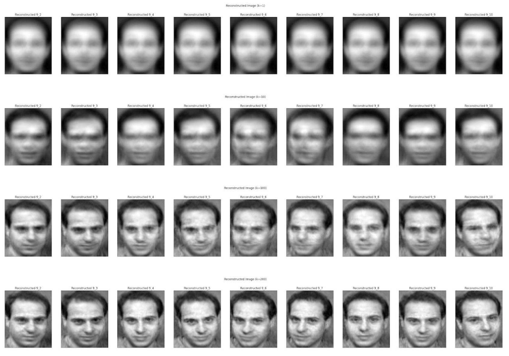

# MathVision

Mathematical Tools for Computer Vision

HW9_Eigenface

parser options:
	-k: (int) number of major component vectors to use (default: 10)
	-a: enables alignment (default: false)
	-r: enables 112x92 resolution (default: 56x46)

alignment.py referenced from:
https://towardsdatascience.com/precise-face-alignment-with-opencv-dlib-e6c8acead262
